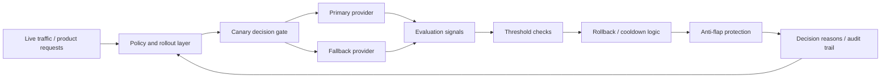

# Tolik

Production-oriented AI reliability and rollout control framework for safe model/provider switching, canary promotion, rollback cooldown, anti-flap protection, fallback routing, and decision traceability.

## Overview

Tolik is the flagship engineering project in my portfolio.

It was created to solve one of the hardest real-world problems in AI products:

**How do you safely ship, evaluate, switch, rollback, and govern AI behavior in production without breaking the product?**

Most AI demos stop at “the model works.”  
Tolik focuses on what happens **after** that point:
- rollout safety
- provider switching
- fallback behavior
- quality and safety thresholds
- controlled rollback
- stability under regression
- operational decision transparency

This repository is not a toy chatbot and not just an “AI app.”  
It is a **production-minded control layer for AI systems**.

## What Tolik is

Tolik is a reliability and orchestration framework for AI/LLM-powered systems.

It acts as a policy and decision layer between:
- live product traffic
- candidate AI providers / model variants
- evaluation logic
- rollback logic
- fallback routing
- governance and audit needs

In practical terms, Tolik is built to answer questions like:
- Should this provider be promoted?
- Should traffic remain in canary mode?
- Should the system rollback now?
- Should the rollback be followed by cooldown?
- Is the system oscillating too often between providers?
- Should fallback routing take over?
- Why exactly was this decision made?

## Why Tolik exists

AI products fail in production not only because of bad prompts or weak models.

They fail because:
- new providers regress unexpectedly
- evaluation results fluctuate
- systems switch too aggressively
- rollback logic is too naive
- providers “flap” between good and bad states
- there is no policy layer connecting reliability to product behavior
- operators cannot clearly explain why a model/provider was promoted or rejected

Tolik was created to solve that production gap.

## Core problem Tolik addresses

A real AI product needs more than inference.

It needs:
- reliability governance
- release discipline
- promotion and rollback logic
- protection against unstable rollouts
- provider qualification rules
- clear traceability of decisions

Tolik is designed as that missing layer.

## What Tolik does

Tolik provides a structured framework for:

- controlled canary rollout decisions
- rollback on quality or safety regression
- cooldown after rollback
- anti-flap protection to prevent unstable oscillation
- fallback provider routing
- decision traceability with explicit reasons
- threshold-based safety and correctness gating
- production-minded behavior under uncertainty

## Quick demo

Run one scenario and inspect the decision trace:

```bash
python scripts/simulate_rollout.py --scenario examples/canary_promotion.json
python scripts/simulate_rollout.py --scenario examples/rollback_cooldown.json
python scripts/simulate_rollout.py --scenario examples/anti_flap_freeze.json
```

Each scenario prints:
- input metrics
- thresholds
- final decision
- reasons
- fallback / cooldown / anti-flap state

## Example scenarios

- `canary_promotion.json` — healthy candidate provider is promoted in canary mode
- `rollback_cooldown.json` — provider is rolled back and placed into cooldown
- `anti_flap_freeze.json` — repeated instability triggers anti-flap freeze

## Key capabilities

### 1. Canary rollout control
Tolik supports staged rollout logic instead of naive instant promotion.

This allows a provider or model configuration to be tested gradually before being trusted with broader traffic.

### 2. Rollback cooldown
A rollback should not immediately be followed by another fast promotion attempt.  
Tolik introduces cooldown behavior so the system can stabilize before trying again.

### 3. Anti-flap protection
One of the most important production behaviors in AI systems is avoiding unstable switching back and forth.

Tolik explicitly models anti-flap windows and repeat-failure tolerance, reducing the chance of chaotic model/provider oscillation.

### 4. Fallback provider routing
When the active provider becomes unreliable, Tolik can route behavior toward a safer fallback option instead of leaving the system exposed.

### 5. Threshold-based decisions
Tolik is built around measurable criteria such as:
- correctness thresholds
- safety thresholds
- regression detection
- repeated failure signals

### 6. Explainable operational decisions
Tolik is not a black box release toggle.  
It records **why** a decision was made.

That matters for:
- debugging
- operator trust
- production support
- postmortem analysis
- governance

## Example of the kind of decision Tolik is built to handle

A typical decision trace can include signals like:

- `trigger_type: canary_rollback`
- `cooldown_rollouts: 1`
- `cooldown_until_rollout_index: 8`
- `anti_flap_window_rollouts: 4`
- `anti_flap_repeat_failures: 2`
- `reasons: correctness_below_threshold, safety_below_threshold, cooldown_until_rollout`

This is exactly the kind of production behavior Tolik is designed for:  
**not only detecting that something went wrong, but deciding what to do next in a controlled way.**

## Why this matters for AI Product Engineering

A lot of candidates can build an AI demo.

Far fewer can design the operational layer required to ship AI safely in a real product.

Tolik demonstrates that I think in terms of:

- production rollout discipline
- reliability under regression
- guardrails and fallback behavior
- system stability over time
- measurable release policy
- engineering structures that support product trust

This is why Tolik is the strongest signal in my portfolio.

## My role

I designed and implemented the reliability logic, rollout control concepts, fallback behavior, operational decision structure, and production-minded framing of the system.

My goal was not to create another AI novelty project, but to build the kind of infrastructure thinking that real AI products need in order to survive contact with production.

## Architecture mindset

Tolik should be understood as a control plane / policy layer rather than a single-model experiment.

At a high level, the logic looks like this:



## Engineering principles behind Tolik

- safety before aggressive promotion
- rollback is a first-class operation
- instability must be managed, not ignored
- provider quality must be evaluated in context
- decision logic should be explicit and inspectable
- operational trust matters as much as model output quality

## What makes Tolik different

Tolik is not positioned as:
- a simple chatbot
- a prompt playground
- a wrapper around a single provider
- a vague “autonomous AI” demo with no production discipline

Tolik is positioned as:
- a reliability layer
- a rollout governance framework
- a control system for AI behavior in production
- a product engineering answer to unstable model/provider operations

## Repository focus

This repository is best viewed as a portfolio-quality engineering artifact that demonstrates:
- AI reliability thinking
- release-control discipline
- production-oriented policy design
- operational awareness beyond inference quality

## Practical relevance

Tolik is relevant to teams building:
- LLM features in customer-facing products
- provider-agnostic AI infrastructure
- evaluation-driven release systems
- internal AI platforms
- assistants and agent systems that need safe upgrade paths

## Why recruiters and engineering leaders should care

This repository shows that I do not think about AI systems only at the demo layer.

I think about:
- what happens when a provider regresses
- how to prevent unstable switching
- how to preserve trust in production
- how to make rollout behavior explicit and auditable
- how to connect model behavior to product reliability

That is the difference between “building an AI feature” and **engineering an AI product system**.

## Tech profile

This project is best positioned under:
- Python
- AI infrastructure
- rollout logic
- production reliability
- policy / orchestration layer
- evaluation-aware release control

## How to read this repository

When reviewing this project, focus on:
- rollout and gating logic
- rollback and cooldown rules
- anti-flap mechanisms
- fallback provider behavior
- decision traceability
- engineering intent around safety and operational stability

## Future improvements

- richer reporting and visualization of rollout decisions
- metrics export and dashboard integration
- stronger scenario simulation for provider regressions
- cleaner public naming and package structure
- test coverage for rollback / anti-flap scenarios
- operator-facing documentation for production adoption

## Positioning summary

If Aurea shows product UI discipline, and Grinex shows backend/system design,  
then Tolik shows something even rarer:

**the ability to design the control and reliability layer required to ship AI systems safely in production.**

That is why Tolik is the flagship project in this portfolio.

## Contact

Open to AI Product Engineer / Product Engineer / AI Systems / Reliability / Backend opportunities.